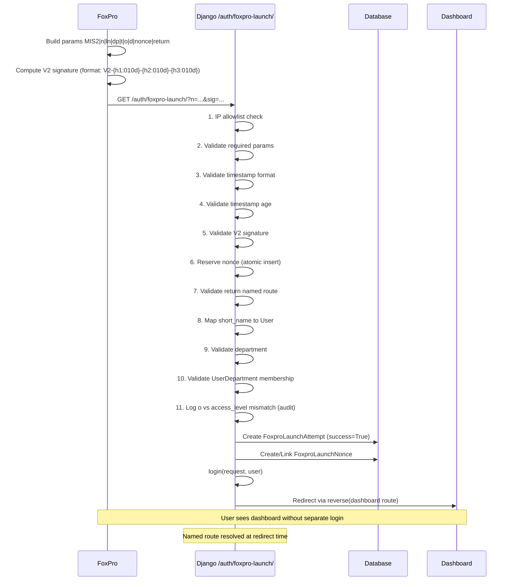

# Phase 4E — FoxPro External Auth Architecture Plan

> **Status:** Phase 4E — architecture plan document
> **Model:** minimax-m2.7
> **Date:** 2026-05-27
> **Scope:** Documentation/planning only. No code, templates, URLs, migrations, or legacy_php modifications.

---

## Table of Contents

1. [Recommended Architecture](#1-recommended-architecture)
2. [Launch URL Contract](#2-launch-url-contract)
3. [HMAC / Helper Options](#3-hmac--helper-options)
4. [Django Architecture](#4-django-architecture)
5. [Django Validation Flow](#5-django-validation-flow)
6. [User Mapping Rules](#6-user-mapping-rules)
7. [Permission Rules](#7-permission-rules)
8. [Security Controls](#8-security-controls)
9. [Legacy Fallback Plan](#9-legacy-fallback-plan)
10. [Implementation Subphases](#10-implementation-subphases)
11. [Test Plan](#11-test-plan)
12. [Final Recommendation](#12-final-recommendation)

---

## 1. Recommended Architecture

### 1.1 Approach: Signed Launch URL with FoxPro-Compatible Custom V2 Signature

The implemented approach is a **Signed Launch URL** pattern with a **FoxPro-compatible custom V2 signature**:

- FoxPro 5 builds normalized launch parameters
- FoxPro 5 uses SHELLEXEC to open a V2-signed launch URL
- Django validates the signature on `GET /auth/foxpro-launch/`
- Django creates a Django session and redirects to the dashboard
- All launch attempts are recorded in an audit log model

**Signature format:** `V2-{h1:010d}-{h2:010d}-{h3:010d}` (custom FoxPro-compatible format, NOT HMAC-SHA256)

**FoxPro-side implementation will be written by the user in FoxPro 5.** Do not assume native HMAC-SHA256, JSON parsing, or modern HTTPS client features in FoxPro 5.

### 1.2 Why Not POST /auth/launch-token/ ?

The existing Phase 4 plan (Section 4.3 Option C/E) proposed a two-step flow:

1. FoxPro calls `POST /auth/launch-token/` to get a short-lived token
2. FoxPro launches Django with `?token=...`

This approach has a problem for FoxPro 5: **FoxPro's existing SHELLEXEC workflow launches URLs directly**. Reading a JSON response and extracting a token adds complexity that may be difficult in FoxPro 5.

A **signed launch URL** simplifies FoxPro 5 changes:

- FoxPro 5 builds the URL with all parameters and a V2 signature
- FoxPro 5 calls SHELLEXEC once with the complete URL
- Django validates and creates session in one request

### 1.3 Recommended Flow

```
┌─────────┐  SHELLEXEC signed URL   ┌──────────────────────┐  validate   ┌────────────┐
│ FoxPro  │ ──────────────────────►  │ GET                  │ ──────────► │ Django     │
│ 5       │  /auth/foxpro-launch/    │ /auth/foxpro-launch/ │              │ Session    │
└─────────┘  ?n=...&ln=...&dp=...    │                      │              │ created    │
             &t=...&d=...&o=...      └──────────────────────┘              └────────────┘
             &nonce=...&return=...    ◄─── redirect ────                     │
             &sig=V2-{h1:010d}-{h2:010d}-{h3:010d}         reverse dashboard route                  │
                               (named route resolved at runtime)
```

### 1.4 Comparison: Signed URL vs. Token Exchange

| Aspect | Signed Launch URL | Token Exchange (Phase 4 Plan) |
|--------|-------------------|-------------------------------|
| FoxPro change | Single SHELLEXEC call | Must call token endpoint, read JSON, then SHELLEXEC |
| FoxPro complexity | Lower | Higher (requires JSON parsing) |
| Django complexity | Single view validates + logs | Two views (token gen + launch) |
| Security | Equivalent (V2 signature + timestamp + nonce) | Equivalent |
| Audit trail | One request logged | Two requests logged (token gen + launch) |
| Token storage | No DB token storage needed | LaunchSession token in DB |
| Replay protection | Nonce stored per launch | Token single-use in DB |

**Recommendation:** Use the Signed Launch URL approach for FoxPro compatibility.

---

## 2. Launch URL Contract

### 2.1 Endpoint

```
GET /auth/foxpro-launch/
```

### 2.2 Parameters

| Param | Type | Required | Description |
|-------|------|----------|-------------|
| `n` | string | Yes | Short name (username) |
| `ln` | string | Yes | Long name (display only) |
| `dp` | string | Yes | Department code |
| `t` | string | Yes | Title (employee title) |
| `d` | string | Yes | Timestamp in `YYYYMMDDHHMMSS` format (local timezone, see Section 2.4) |
| `o` | string | No | Legacy access level (audit only, not used for authorization) |
| `nonce` | string | Yes | Random unique string (32+ chars recommended) |
| `return` | string | No | Named route for redirect after login (default: `project_requests:dashboard`) |
| `sig` | string | Yes | Custom V2 signature in format `V2-{h1:010d}-{h2:010d}-{h3:010d}` |

### 2.3 Canonical Signing String

The signing string is the pipe-delimited concatenation of all parameters in a **fixed order**:

```
MIS2|n|ln|dp|t|o|d|nonce|return
```

**Note:** The `sig` parameter is NOT included in the signing string. It is the output.

**Normalization before signing:**
- All values must be **trimmed** (leading/trailing whitespace removed)
- Values are signed as **raw normalized values**, then URL-encoded for transport
- Case is preserved as-is in the signing string (matching is case-insensitive for user lookup, but the signature uses exact trimmed values)

**Example:**

```
n=john.smith
ln=John Smith
dp=ACCT
t=Sr. Accountant
d=20260527192015
o=2
nonce=a7f3c8d2e9b4f1a6c0d5e8f2b3a7c1d4
return=project_requests:dashboard
```

Normalized (trimmed) signing string:
```
MIS2|john.smith|John Smith|ACCT|Sr. Accountant|2|20260527192015|a7f3c8d2e9b4f1a6c0d5e8f2b3a7c1d4|project_requests:dashboard
```

Django resolves `return=project_requests:dashboard` to actual path (e.g., `/project_requests/dashboard/`) at redirect time using `reverse()`.

**V2 signature key:** shared secret from `settings.FOXPRO_V2_SECRET`
**V2 signature output:** custom format `V2-{h1:010d}-{h2:010d}-{h3:010d}` (NOT HMAC-SHA256 hex)
**Canonical string format:** `MIS2|n|ln|dp|t|o|d|nonce|return`

### 2.4 Timestamp Format and Max Age

- **Format:** `YYYYMMDDHHMMSS` (14 characters, local workstation time)
- **Timezone:** Configured via `FOXPRO_LAUNCH_TIMEZONE` setting (default: `America/Los_Angeles`)
- **Max age:** 15 seconds (configured via `FOXPRO_LAUNCH_MAX_AGE_SECONDS`)
- **Recommendation:** Use local workstation time on FoxPro side; Django interprets timestamp in configured timezone

### 2.5 Return URL Safety

The `return` parameter accepts Django named routes. Django resolves them to actual paths at redirect time.

| Named route | Description | Pilot status |
|-------------|-------------|--------------|
| `project_requests:dashboard` | Dashboard (default) | **Pilot — allowed** |
| `project_requests:index` | Request list | **Pilot — allowed** |
| `admin:index` | Admin index | Future/optional only, not part of pilot |

**Important:** The actual external URL path (e.g., `/project-requests/dashboard/` vs `/project_requests/dashboard/`) depends on the URL configuration in `config/urls.py`. The allowlist uses named routes to avoid hard-coding external paths. Final path confirmation is required before Phase 4F.

---

## 3. HMAC / Helper Options

FoxPro 5 does not have built-in HMAC-SHA256, JSON parsing, or modern HTTPS client features. The following options are ranked by recommendation.

### 3.1 Option A: FoxPro 5 Computes V2 Signature Directly

**Feasibility: This is the current pilot approach.** FoxPro 5 computes the custom V2 signature directly without external helpers.

| Aspect | Assessment |
|--------|------------|
| FoxPro change required | Medium — FoxPro 5 computes V2 signature directly |
| Django change required | None (validate V2 signature) |
| Security level | Custom / non-standard; no standard MAC or formal cryptographic assurance established; acceptable for scoped internal pilot with compensating controls |
| Implementation complexity | Medium (FoxPro side) |
| Recommendation | **Current pilot approach** |

### 3.2 Option B: FoxPro 5 Calls Local Helper EXE/DLL (Future Alternative)

FoxPro 5 calls a small compiled helper (EXE or DLL) that computes the V2 signature. The helper is deployed on the same machine as FoxPro 5.

| Aspect | Assessment |
|--------|------------|
| FoxPro change required | Medium — FoxPro 5 calls helper via RUN command |
| Django change required | None |
| Security level | Custom / non-standard; no standard MAC or formal cryptographic assurance established; acceptable for scoped internal pilot with compensating controls |
| Implementation complexity | Medium (helper development) |
| Recommendation | **Future alternative only** — NOT current pilot |

**Helper requirements:**
- Accepts signing string and parameters as input
- Computes and returns V2 signature (format: `V2-{h1:010d}-{h2:010d}-{h3:010d}`)
- **Does NOT receive shared secret as command-line argument** — secret should be stored in protected local config file, environment variable, or compiled into the helper
- Helper should also generate the nonce (see Section 3.6) to avoid weak RNG in FoxPro 5

**Helper secret storage options (preferred order):**
1. Helper reads secret from a protected config file with restricted file permissions
2. Helper embeds secret at compile time (less rotation flexibility)
3. Helper reads from environment variable

**Important:** A local helper containing a shared secret is still an internal-trust compromise and should be protected with file permissions and access controls.

### 3.3 Option C: FoxPro 5 Calls Internal Broker Service (Future Alternative)

FoxPro 5 calls an internal broker/middleware service via HTTPS. The broker computes the V2 signature and returns the signature or signed URL.

| Aspect | Assessment |
|--------|------------|
| FoxPro change required | Medium — FoxPro 5 calls broker with employee info via HTTP GET |
| Django change required | None (standard V2 signature validation) |
| Security level | Custom / non-standard; no standard MAC or formal cryptographic assurance established; acceptable for scoped internal pilot with compensating controls |
| Implementation complexity | Medium-High (broker service) |
| Recommendation | **Future alternative only** — NOT current pilot |

**Broker requirements:**
- HTTPS endpoint (internal network only)
- Accepts employee info + timestamp + nonce request
- Returns V2 signature or complete signed URL
- Can be a simple Python/Node script
- Broker holds the shared secret and performs signing internally

### 3.4 Option D: Legacy XOR + IP Allowlist Fallback (Temporary Only)

FoxPro 5 continues using the existing XOR-based `encryptString(d, t)`. Django validates the XOR signature and timestamp. IP allowlist restricts requests to FoxPro server IPs only.

**This is NOT recommended for long-term use.** The XOR signature is weak and reversible. Only for temporary pilot use with a defined sunset.

| Aspect | Assessment |
|--------|------------|
| FoxPro change required | None |
| Django change required | Low — validate XOR + timestamp |
| Security level | Low — XOR is reversible |
| Implementation complexity | Low |
| Recommendation | **Only as temporary pilot fallback with sunset, not long-term** |

See [Section 9: Legacy Fallback Plan](#9-legacy-fallback-plan) for details.

### 3.5 Recommendation Summary

| Priority | Option | Rationale |
|----------|--------|-----------|
| 1 **(Current pilot)** | **Custom V2 Signature** | FoxPro-compatible custom signature format `V2-{h1:010d}-{h2:010d}-{h3:010d}`; implemented in Phase 4F |
| 2 | **Option B: Helper EXE/DLL** | Future alternative: helper computes V2 signature; no secret passed via command-line |
| 3 | **Option C: Internal Broker** | Future alternative: centralized V2 signature key management |
| 4 | **Option A: FoxPro Direct** | Current pilot approach (same as priority 1) |
| 5 | **Option D: Legacy Fallback** | Not implemented in Phase 4F pilot |

**Phase 4F pilot uses:**
- `external_auth` app
- `GET /auth/foxpro-launch/`
- `v=2` only (no v1 fallback)
- `FOXPRO_V2_SECRET` setting
- Custom V2 signature format `V2-{h1:010d}-{h2:010d}-{h3:010d}`
- Nonce replay protection
- `o` parameter: audit-only, NOT used for Django authorization
- No LaunchSession/token exchange
- No HMAC-SHA256 (HMAC/helper/broker remain as future alternatives only)

### 3.6 Nonce Generation for FoxPro 5

FoxPro 5 may not have a cryptographically strong random number generator. Acceptable strategies:

| Strategy | Description | Recommendation |
|----------|-------------|----------------|
| **Helper generates nonce** | Helper EXE/DLL generates nonce and returns it along with V2 signature | **Preferred** — use if helper is deployed |
| **FoxPro SYS(2015) + timestamp** | FoxPro's `SYS(2015)` returns a unique 10-character string; combine with timestamp | Acceptable fallback |
| **Counter + timestamp** | Increment a persistent counter combined with timestamp | Acceptable if counter is persisted |
| **Timestamp + short name hash** | Combine timestamp with short name, hash to create uniqueness | Acceptable fallback |

If nonce quality is weak, the timestamp max age (15 seconds) and V2 signature still provide significant replay protection.

**Django stores all nonces and rejects reuse regardless of generation method.**

---

## 4. Django Architecture

### 4.1 App Location: New `external_auth` App

**Recommendation:** Create a new `external_auth` Django app, separate from `accounts` and `project_requests`.

**Rationale:**
- Isolates external auth bridge from core project_requests workflow
- Clear separation of concerns — external auth is a trust boundary
- Easy to disable or remove if the auth mechanism changes
- Avoids mixing external auth models with `accounts.User`

### 4.2 New Models

#### FoxproLaunchAttempt

Records every launch attempt for audit purposes.

| Field | Type | Description |
|-------|------|-------------|
| `id` | AutoField | Primary key |
| `short_name` | CharField(150) | Employee short name from launch URL |
| `long_name` | CharField(255) | Employee long name from launch URL (display only) |
| `dept_code` | CharField(20) | Department code from launch URL |
| `title` | CharField(150) | Employee title from launch URL |
| `legacy_access_level` | CharField(10, nullable) | FoxPro `o` param — audit only |
| `nonce_hash` | CharField(64) | SHA-256 hash of nonce from launch URL (for audit) |
| `source_ip` | GenericIPAddressField | Client IP address |
| `signature_valid` | BooleanField | V2 signature passed validation |
| `timestamp_valid` | BooleanField | Timestamp within max age |
| `user` | ForeignKey(User, null) | Mapped Django user (null if no match) |
| `success` | BooleanField | Launch succeeded (user found, session created) |
| `failure_reason` | CharField(255, nullable) | Short failure reason code |
| `return_path` | CharField(255) | Requested return path (named route) |
| `raw_params` | JSONField (nullable) | Snapshot of all params (safe fields only) |
| `created_at` | DateTimeField(auto_now_add) | Attempt timestamp |
| `nonce_reservation` | OneToOneField(FoxproLaunchNonce, null) | Link to nonce reservation record |

**Indexes:**
- `(nonce_hash)` — for audit queries (not unique, allows logging repeated failed attempts)
- `(short_name, dept_code, created_at)` — for audit queries
- `(source_ip, created_at)` — for rate limiting queries

#### FoxproLaunchNonce

Stores nonce reservations for replay prevention. Separate from FoxproLaunchAttempt to allow logging all replay attempts (both successful and failed).

| Field | Type | Description |
|-------|------|-------------|
| `id` | AutoField | Primary key |
| `nonce_hash` | CharField(64) | SHA-256 hash of the nonce (unique) |
| `source_ip` | GenericIPAddressField | IP that first presented this nonce |
| `first_seen_at` | DateTimeField(auto_now_add) | When nonce was first reserved |
| `launch_attempt` | OneToOneField(FoxproLaunchAttempt, null) | Link to successful launch if completed |

**Indexes:**
- `(nonce_hash)` — unique index for replay detection
- `(first_seen_at)` — for cleanup of old nonce records

**Design rationale:** Storing nonce_hash (not raw nonce) protects against audit log exposure. The unique constraint prevents nonce reuse even across different source IPs.

#### FoxproLaunchSession — SUPERSEDED (DO NOT IMPLEMENT for Phase 4F)

> **This model is part of the deprecated token-exchange flow.** Phase 4F uses the Signed Launch URL pattern, NOT token exchange. This model is retained only for historical reference and is marked as superseded.

**Old token-exchange design (NOT implemented in Phase 4F):**

| Field | Type | Description |
|-------|------|-------------|
| `id` | AutoField | Primary key |
| `token_hash` | CharField(64) | SHA-256 of the random token |
| `user` | ForeignKey(User) | Mapped Django user |
| `expires_at` | DateTimeField | Token expiry (utc_now + 60 seconds) |
| `used_at` | DateTimeField (nullable) | When token was used |
| `source_ip` | GenericIPAddressField | IP that created the token |
| `created_at` | DateTimeField(auto_now_add) | Creation timestamp |

**Token properties (old design, not used):**
- Random 32+ byte token generated with `secrets.token_bytes(32)`
- Only the SHA-256 hash was stored (not the raw token)
- Single-use: `used_at` set on first use
- Expires: 60 seconds after creation

**Phase 4F uses `FoxproLaunchAttempt` + `FoxproLaunchNonce` only.**

### 4.3 New Views

| View | URL | Method | Purpose |
|------|-----|--------|---------|
| `foxpro_launch` | `/auth/foxpro-launch/` | GET | Validate signed launch URL, create session |

### 4.4 URL Configuration

```python
# external_auth/urls.py
from django.urls import path
from . import views

app_name = 'external_auth'

urlpatterns = [
    path('foxpro-launch/', views.foxpro_launch, name='foxpro_launch'),
]
```

```python
# config/urls.py
urlpatterns = [
    # ... existing urlpatterns
    path('auth/', include('external_auth.urls')),
]
```

### 4.5 Settings

```python
# config/settings.py

# FoxPro V2 Signature Settings
FOXPRO_SIGNATURE_MODE = 'legacy_v2'  # Required: must be 'legacy_v2' for pilot
FOXPRO_V2_SECRET = env('FOXPRO_V2_SECRET')  # Shared secret for V2 signature
FOXPRO_LAUNCH_MAX_AGE_SECONDS = 15  # 15 seconds (local workstation time)
FOXPRO_LAUNCH_TIMEZONE = 'America/Los_Angeles'  # Timezone for timestamp interpretation

# IP Allowlist: Empty for internal network, or specific IPs/subnets
# FOXPRO_ALLOWED_IPS = []  # Allow all (internal network)
# FOXPRO_ALLOWED_IPS = ['10.0.0.0/8']  # Internal subnet only

# X-Forwarded-For Trust: Default False (use REMOTE_ADDR)
# Set True only if behind a trusted proxy
FOXPRO_TRUST_X_FORWARDED_FOR = False

FOXPRO_ALLOWED_RETURN_PATHS = [
    'project_requests:dashboard',  # Use named route for internal redirect
    'project_requests:index',        # Pilot — allowed
    # 'admin:index' — NOT part of pilot, future/optional only
]
```

### 4.6 Shared Secret Storage

- **Never hardcode** the V2 secret in source code
- Store in environment variable or secret management system
- Django settings reads from environment: `FOXPRO_V2_SECRET = env('FOXPRO_V2_SECRET')`
- Rotate the secret if a potential compromise is reported

### 4.7 IP Allowlist / Deployment Topology

**Current pilot deployment: Network-share EXE on local workstations**

- FoxPro 5 runs on each user's local workstation
- EXE is deployed via network share (not installed locally)
- Django sees requests from the workstation/browser IP
- IP allowlist may allow internal subnet ranges (e.g., 10.0.0.0/8) or be empty for internal network
- Trust proof: V2 signature + nonce + timestamp (no IP allowlist dependency)

**Legacy central terminal/server option (future alternative only):**
- FoxPro 5 runs on a single shared server (central terminal/server)
- Django sees requests from the server's static IP
- IP allowlist restricts to that known server IP (or small server subnet)
- Trust proof: V2 signature + IP allowlist (static server IP)

---

## 5. Django Validation Flow

The `foxpro_launch` view performs validation in strict order:

### 5.1 Validation Order

**Critical: Never sanitize or replace the `return` parameter before signature validation. The V2 signature is computed over the exact `return` value provided by FoxPro. Any substitution before signature check would invalidate the signature.**

```
0. Check FOXPRO_SIGNATURE_MODE is 'legacy_v2'
   → If not: log failed FoxproLaunchAttempt (UNSUPPORTED_SIGNATURE_MODE), 400 Bad Request
   → **Important:** No nonce reserved, no params available for audit

1. Check source IP against FOXPRO_ALLOWED_IPS (if configured)
   → 400 Bad Request if not in allowlist

2. Validate all required parameters present (v, n, ln, dp, t, d, nonce, return, sig)
   → 400 Bad Request if missing

3. Require v == "2" (v1 fallback not implemented)
   → 400 Bad Request if version is not "2"

4. Validate timestamp format (YYYYMMDDHHMMSS)
   → 400 Bad Request if malformed

5. Validate timestamp age (d within FOXPRO_LAUNCH_MAX_AGE_SECONDS of current time, interpreted in FOXPRO_LAUNCH_TIMEZONE)
   → 400 Bad Request if too old

6. Compute V2 signature over the raw normalized params:
   canonical_string = f"MIS2|{n}|{ln}|{dp}|{t}|{o}|{d}|{nonce}|{return}"
   expected_sig = foxpro_sign_v2(canonical_string, FOXPRO_V2_SECRET)

7. Validate V2 signature using secrets.compare_digest:
   → If mismatch: log failed FoxproLaunchAttempt (WITHOUT reserving nonce), 400 Bad Request
   → **Important:** Invalid signature must NOT reserve the nonce. Nonce reservation happens only after signature passes.

8. Atomically reserve nonce_hash in FoxproLaunchNonce:
   - Hash the nonce: nonce_hash = hashlib.sha256(nonce.encode()).hexdigest()
   - Attempt to insert nonce_hash with unique constraint
   - If already exists: reject as NONCE_REUSED, log FoxproLaunchAttempt failure, **still create a failed FoxproLaunchAttempt record**, done
   → **Important:** A reused nonce must still create a failed FoxproLaunchAttempt entry for audit purposes, even though the request is rejected.
   - If inserted: nonce is now reserved for this request
   → 400 Bad Request if duplicate

9. Validate return path against FOXPRO_ALLOWED_RETURN_PATHS:
   - Check if `return` matches a named route in the allowlist
   - If not allowed: redirect to default dashboard (do not substitute in signature)
   → If invalid, redirect to reverse("project_requests:dashboard")

10. Map short_name to Django User (deterministic order):
    - Normalize n: strip whitespace, convert to lowercase for matching
    - First: User.objects.filter(employee_id__iexact=normalized_n, is_active=True).first()
    - If not found: User.objects.filter(username__iexact=normalized_n, is_active=True).first()
    → 400 Bad Request if no match
    → Note: `ln` (long name) is NOT used for identity matching; it is display/audit only

11. Validate department code maps to active Department:
    - Normalize dp: strip whitespace
    - Department.objects.filter(dept_code__iexact=normalized_dp, is_active=True).first()
    → 400 Bad Request if no match

12. Validate active UserDepartment membership (required for pilot):
    - UserDepartment.objects.filter(user=user, department=department, is_active=True).exists()
    → 400 Bad Request if no active membership
    → This is a STRICT pilot requirement; all launched users must have active UserDepartment

13. Check FoxPro `o` vs Django access_level (audit only):
    - Compare FoxPro `o` with UserDepartment.access_level
    - If mismatch: Log WARNING (do NOT update Django permissions, do NOT inform user)
    - FoxPro `o` must NEVER create, update, or determine Django authorization

14. Create Django session with login():
    - login(request, user)
    - Set session expiry to reasonable timeout

15. Record FoxproLaunchAttempt:
    - success=True, signature_valid=True, timestamp_valid=True, user=user
    - Link to FoxproLaunchNonce record (the one reserved in step 8)

16. Redirect via reverse():
    - Use reverse() to resolve the named route to actual path
    - External path depends on URL configuration
```

### 5.1.1 Error Message Policy

**User-facing errors must be generic.** Do not leak validation details to end users:

| DON'T say | DO say |
|-----------|--------|
| "Invalid signature" | "Unable to launch. Please contact IT support." |
| "User not found" | "Unable to launch. Please contact IT support." |
| "Nonce reused" | "Unable to launch. Please contact IT support." |
| "Timestamp expired" | "Unable to launch. Please contact IT support." |

**Internal audit records keep detailed failure_reason codes.** The `FoxproLaunchAttempt.failure_reason` field stores specific reason codes (`INVALID_SIGNATURE`, `NONCE_REUSED`, `USER_NOT_FOUND`, etc.) for internal debugging and security auditing.

### 5.2 Failure Handling

On any failure:

1. Record `FoxproLaunchAttempt` with:
   - `success=False`
   - `failure_reason` = short code (see below)
   - `signature_valid`, `timestamp_valid` as applicable

2. Return generic error page — **do NOT leak validation details**:
   - Do NOT say "invalid signature" to end user (timing attack risk)
   - Do NOT say "user not found" (enumeration risk)
   - Show: "Unable to launch. Please contact IT support."

### 5.3 Failure Reason Codes

| Code | Meaning |
|------|---------|
| `IP_BLOCKED` | Source IP not in allowlist |
| `MISSING_PARAMS` | Required parameter missing |
| `INVALID_VERSION` | Version `v` is not "2" |
| `INVALID_TIMESTAMP_FORMAT` | `d` parameter malformed |
| `TIMESTAMP_EXPIRED` | Timestamp too old |
| `INVALID_SIGNATURE` | V2 signature mismatch |
| `NONCE_REUSED` | Nonce already seen |
| `UNSUPPORTED_SIGNATURE_MODE` | `FOXPRO_SIGNATURE_MODE` is not `legacy_v2` |
| `USER_NOT_FOUND` | No Django user matches `n` (tried employee_id then username) |
| `USER_INACTIVE` | User exists but `is_active=False` |
| `DEPT_NOT_FOUND` | Department code `dp` does not map to an active Department |
| `DEPT_MEMBERSHIP_MISSING` | User has no active UserDepartment for department `dp` |
| `UNKNOWN_ERROR` | Unexpected exception |

---

## 6. User Mapping Rules

### 6.1 Pilot Mapping Rules (Strict)

For the pilot implementation, the following mapping rules are **strictly enforced**:

| Rule | Description |
|------|-------------|
| **User must pre-exist** | The Django user must already exist in the system. No auto-creation. |
| **Deterministic matching order** | First: `employee_id == n` (if populated). Second fallback: `username == n` |
| **Case-insensitive, whitespace trimmed** | Matching uses `__iexact` and strips whitespace from `n` before lookup |
| **User must be active** | `user.is_active == True` |
| **Department must exist** | `Department.objects.filter(dept_code__iexact=normalized_dp, is_active=True).exists()` |
| **Active UserDepartment required** | `UserDepartment.objects.filter(user=user, department=department, is_active=True).exists()` |
| **No auto-create** | If user doesn't exist, has no active UserDepartment, launch fails. Explicit provisioning required. |

### 6.2 Matching Algorithm

```
1. Normalize n: strip whitespace, convert to lowercase for matching
2. Normalize dp: strip whitespace
3. First try: User.objects.filter(employee_id__iexact=normalized_n, is_active=True).first()
4. If not found: User.objects.filter(username__iexact=normalized_n, is_active=True).first()
5. If user found: verify Department.objects.filter(dept_code__iexact=normalized_dp, is_active=True).first()
6. If department found: verify UserDepartment.objects.filter(user=user, department=department, is_active=True).exists()
7. If all pass: user is matched
8. If any step fails: reject launch with appropriate failure reason
```

### 6.3 Why `ln` (Long Name) is Display Only

The `ln` (long name) parameter from FoxPro is **not used as identity proof** because:

| Risk | Implication |
|------|-------------|
| `ln` is transmitted in the URL | Can be captured in server logs, referrer headers |
| `ln` can be spoofed | Attacker can forge URLs with any name |
| No verification mechanism | Django cannot confirm `ln` matches the actual user |
| Display only is sufficient | The Django `User.first_name` / `User.last_name` fields provide display name |

**Rule:** `ln` from FoxPro is stored in the audit log but never used for identity verification. Django uses `User.username` or `User.employee_id` as the identity anchor.

### 6.3 Auto-Creation Consideration

Auto-creation (creating a Django User if one doesn't exist) is **not recommended** for the pilot because:

- No verified identity source beyond FoxPro URL parameters
- FoxPro URL params can be forged by anyone on the internal network
- Permissions and department assignments need explicit configuration

Auto-creation may be reconsidered in a later phase if:
- A separate identity verification mechanism is added
- IT provisioning workflow is established
- Risk acceptance is documented

---

## 7. Permission Rules

### 7.1 Critical: FoxPro `o` is NOT Trusted for Authorization

**The `o` (legacy access level) parameter from FoxPro must NEVER determine Django permissions.**

| Reason | Explanation |
|--------|-------------|
| `o` is in the URL | Can be captured and modified in logs/proxies |
| FoxPro XOR is weak | `o` can be forged by anyone with FoxPro source |
| No server-side verification | Django cannot confirm `o` was set by FoxPro |

### 7.2 Django Permission Sources

Django permissions **must** come from:

- `accounts.User` — `is_active`, `is_staff`, `is_superuser`
- `accounts.Department` — department data
- `accounts.UserDepartment` — `access_level`, `can_approve`, `is_active`

### 7.3 Mismatch Logging

If FoxPro `o` is present and differs from the user's actual `UserDepartment.access_level`:

1. Log a warning with the audit record:
   ```
   WARNING: FoxPro access level mismatch for user {username}:
   FoxPro o={fo_pro_o}, Django access_level={django_access_level}
   ```

2. **Do NOT** update Django permissions based on FoxPro `o`

3. **Do NOT** inform the user of the mismatch (avoids information disclosure)

4. **Reject launch if FoxPro `o` is used to infer authorization** — the `o` value is audit-only and must not affect the launch decision in any way

### 7.4 Pilot Permission Rules Summary

For the pilot phase, the following rules are **strictly enforced**:

| Rule | Enforcement |
|------|-------------|
| FoxPro `o` is audit-only | Never used to determine authorization |
| Active UserDepartment required | Reject launch if no active membership in `dp` department |
| Django permissions from UserDepartment | `access_level` and `can_approve` from `accounts.UserDepartment` only |
| `o` mismatch logged as warning | No action taken; user proceeds with Django-determined permissions |

### 7.4 Permission Decision Flow

```
Django session created
       ↓
User accesses /project_requests/dashboard/
       ↓
project_requests/permissions.py rules applied
       ↓
User sees only data allowed by:
- UserDepartment.access_level
- UserDepartment.can_approve
- Selector visibility rules
       ↓
FoxPro `o` is never consulted
```

---

## 8. Security Controls

### 8.1 Required Security Controls

| Control | Requirement | Implementation |
|---------|-------------|----------------|
| **HTTPS** | Required for all launch URLs | Enforce in deployment; redirect HTTP to HTTPS |
| **IP Allowlist** | Restrict to FoxPro server IPs | `FOXPRO_ALLOWED_IPS` setting + middleware check |
| **V2 Shared Secret** | 32+ byte random secret | Environment variable; not in source code |
| **Timestamp Max Age** | 15 seconds | Validation in view; reject if `d` too old |
| **Nonce Replay Protection** | Nonce must be unique | Store `nonce_hash` in `FoxproLaunchNonce` with unique constraint; `FoxproLaunchAttempt` records every attempt and links to nonce reservation |
| **Audit Logging** | All attempts logged | `FoxproLaunchAttempt` record for every request |
| **Rate Limiting** | Prevent brute force | Limit launch attempts per IP (e.g., 10/minute) |
| **Safe Return URL** | Validate `return` against allowlist | `FOXPRO_ALLOWED_RETURN_PATHS` check |
| **Error Message Sanitization** | Do not leak validation details | Generic error page; details in server logs only |
| **Normal Django Login** | Fallback always available | `/admin/login/` still works |

### 8.2 IP Allowlist Details

```python
# external_auth/middleware.py
import ipaddress
from django.http import HttpResponseForbidden

class FoxProIPAllowlistMiddleware:
    EXEMPT_PATHS = ['/admin/login/', '/auth/foxpro-launch/']

    def __init__(self, get_response):
        self.get_response = get_response
        self.allowed_networks = [
            ipaddress.ip_network(ip) 
            for ip in settings.FOXPRO_ALLOWED_IPS
        ]

    def __call__(self, request):
        if request.path == '/auth/foxpro-launch/':
            client_ip = get_client_ip(request)
            if not self._is_ip_allowed(client_ip):
                return HttpResponseForbidden("Access denied.")
        return self.get_response(request)

    def _is_ip_allowed(self, ip):
        ip_obj = ipaddress.ip_address(ip)
        return any(ip_obj in network for network in self.allowed_networks)
```

### 8.3 Rate Limiting Details

```python
# external_auth/ratelimit.py
from django.core.cache import cache
from django.http import HttpResponseTooManyRequests

def rate_limit_by_ip(request, limit=10, window=60):
    """Rate limit by IP address using Django cache."""
    ip = get_client_ip(request)
    key = f'foxpro_launch_rate:{ip}'
    
    count = cache.get(key, 0)
    if count >= limit:
        return False
    
    cache.set(key, count + 1, window)
    return True
```

---

## 9. Legacy Fallback Plan

**This section describes a temporary fallback only if V2 signature is not feasible. This is NOT recommended for long-term use.**

### 9.1 When to Use This Fallback

- User confirms FoxPro 5 cannot implement V2 signature in any form
- Helper EXE/DLL cannot be deployed
- Internal broker cannot be stood up
- A quick pilot is needed before proper V2 signature solution is ready

### 9.2 Legacy Fallback Design

**Endpoint:** `GET /auth/foxpro-legacy-launch/`

**Parameters:** Same as existing legacy PHP launch (for compatibility):

| Param | Description |
|-------|-------------|
| `t` | Title (encryption key) |
| `dp` | Department code |
| `d` | Datetime string |
| `s` | XOR signature: `encryptString(d, t)` |
| `o` | Legacy access level (audit only) |
| `n` | Short name |
| `ln` | Long name |

**Validation:**
1. Source IP must be in `FOXPRO_LEGACY_ALLOWED_IPS` (stricter than main allowlist)
2. Timestamp `d` within 60 seconds of server time
3. Reconstruct XOR signature: `encryptString(d, t)` and compare to `s`
4. If signature matches, treat as identity hint (not strong auth)
5. Map user by `n` (short_name)
6. Log all attempts with `signature_valid=False` if XOR fails

**Security properties:**
- IP allowlist is strict (known FoxPro server IPs only)
- All attempts are logged regardless of success/failure
- FoxPro `o` is still audit-only, never used for permissions
- Legacy endpoint has a **sunset date** (must be deprecated within pilot period)

### 9.3 Sunset Plan

| Milestone | Deadline |
|-----------|----------|
| Legacy fallback deployed for pilot | Pilot start |
| Pilot completes V2 signature migration | Pilot end (target: 30 days) |
| Legacy fallback disabled | After pilot + V2 signature migration |

**The legacy fallback is a temporary bridge, not a long-term solution.**

---

## 10. Implementation Subphases

### 10.1 Phase 4E-1: Architecture Plan (This Document)

**Allowed work:**
- Write `documents/FOXPRO_AUTH_PLAN.md`
- Design `FoxproLaunchAttempt` model schema
- Design validation flow
- Design security controls
- Design V2 signature approach

**Forbidden work:**
- Implementing any code
- Creating migrations
- Modifying existing code

**Files created:**
- `documents/FOXPRO_AUTH_PLAN.md`

**Exit criteria:**
- This plan is approved by user
- User confirms FoxPro 5 implementation approach
- User mapping key is confirmed

---

### Phase 4E-2: FoxPro 5 Capability Spike

**Objective:** Determine FoxPro 5's ability to implement custom V2 signature and select an approach.

**Actions:**
- User confirms FoxPro 5 implementation approach (direct V2 signature computation)
- Evaluate if FoxPro 5 can compute custom V2 signature directly
- Document the FoxPro 5 changes required

**Decisions to document:**
- Can FoxPro 5 compute custom V2 signature directly?
- What is the shared secret delivery mechanism?
- What is the FoxPro 5 deployment timeline?

**Exit criteria:**
- User confirms V2 signature approach for FoxPro 5
- FoxPro-side change requirements are documented
- Shared secret is generated and secured

---

### Phase 4F-1: external_auth App + Model + Settings

**Allowed work:**
- Create `external_auth/` Django app
- Create `FoxproLaunchAttempt` model
- Create `FoxproLaunchNonce` model (for nonce reservation/replay prevention)
- Add `FOXPRO_V2_SECRET`, `FOXPRO_ALLOWED_IPS`, etc. to settings
- Create migration

**Forbidden work:**
- Modifying `accounts` app models
- Modifying `project_requests` workflow code
- Implementing views yet

**Files created:**
- `external_auth/__init__.py`
- `external_auth/apps.py`
- `external_auth/models.py` (FoxproLaunchAttempt, FoxproLaunchNonce)
- `external_auth/migrations/`
- `config/settings.py` additions

**Exit criteria:**
- Migration applies cleanly
- New app is importable
- Settings are set in environment

---

### Phase 4F-2: Signed Launch Validation View + Tests

**Allowed work:**
- Implement `foxpro_launch` view
- Implement V2 signature validation
- Implement validation flow (IP, timestamp, nonce, return URL)
- Implement user mapping
- Implement audit logging
- Write tests

**Forbidden work:**
- Modifying Phase 3 workflow code
- Creating new URLs outside `external_auth`
- Modifying `project_requests` selectors

**Files created/modified:**
- `external_auth/views.py`
- `external_auth/urls.py`
- `external_auth/tests.py`
- `external_auth/middleware.py` (optional)

**Tests to write:**
- Valid signed launch: user logged in, redirect to dashboard
- Invalid signature: 400 error
- Expired timestamp: 400 error
- Reused nonce: 400 error
- Unknown user: 400 error
- Inactive user: 400 error
- Department mismatch: logged, rejected (pilot rule)
- `o` mismatch: logged warning, no permission change
- Unsafe return URL: redirected to dashboard
- IP allowlist: 403 for blocked IPs
- Audit records: success and failure both logged

**Exit criteria:**
- All tests pass
- V2 signature validation is secure
- Audit logging is complete

---

### Phase 4F-3: FoxPro 5 Integration Test

**Allowed work:**
- Coordinate end-to-end test with user (who implements FoxPro 5 side)
- Test signed URL generation from FoxPro 5 (or helper)
- Test full launch flow: FoxPro 5 → Django → Dashboard

**Forbidden work:**
- Modifying FoxPro 5 code (user does this)

**Exit criteria:**
- FoxPro 5 can generate valid signed URL
- User successfully lands on dashboard after FoxPro launch
- Audit log shows successful launch

---

### Phase 4F-4: Legacy Fallback (Only If Approved)

**Allowed work:**
- Implement `GET /auth/foxpro-legacy-launch/` view
- Implement XOR signature validation
- Implement stricter IP allowlist
- Add sunset date to settings

**Forbidden work:**
- Making legacy fallback the primary mechanism
- Extending legacy fallback beyond sunset date

**Exit criteria:**
- Legacy fallback works for pilot if needed
- Sunset date is enforced in settings

---

## 11. Test Plan

### 11.1 Test Categories

#### Unit Tests (external_auth/tests.py)

| Test | Description | Expected Result |
|------|-------------|-----------------|
| `test_valid_signed_launch` | Valid V2 signature, valid user, valid timestamp | User logged in, redirect to dashboard |
| `test_invalid_signature` | Wrong V2 sig | 400 Bad Request, `failure_reason=INVALID_SIGNATURE` |
| `test_expired_timestamp` | Timestamp > 15 seconds old | 400 Bad Request, `failure_reason=TIMESTAMP_EXPIRED` |
| `test_reused_nonce` | Nonce already in `FoxproLaunchNonce` | 400 Bad Request, `failure_reason=NONCE_REUSED` |
| `test_unknown_user` | `n` matches no Django user | 400 Bad Request, `failure_reason=USER_NOT_FOUND` |
| `test_inactive_user` | User exists but `is_active=False` | 400 Bad Request, `failure_reason=USER_INACTIVE` |
| `test_department_not_found` | Department code `dp` doesn't exist | 400 Bad Request, `failure_reason=DEPT_NOT_FOUND` |
| `test_department_mismatch` | User exists but no active `UserDepartment` for `dp` | 400 Bad Request, `failure_reason=DEPT_MEMBERSHIP_MISSING` |
| `test_fo_pro_o_mismatch` | FoxPro `o` differs from Django `access_level` | Warning logged, Django permissions unchanged |
| `test_unsafe_return_url` | `return=/etc/passwd` or similar | Redirect to dashboard instead |
| `test_ip_not_in_allowlist` | Request from non-allowed IP | 403 Forbidden |
| `test_audit_success` | Successful launch | `FoxproLaunchAttempt` record with `success=True` |
| `test_audit_failure` | Failed launch (e.g., bad sig) | `FoxproLaunchAttempt` record with `success=False`, `failure_reason` set |
| `test_employee_id_match` | User matched by `employee_id` (not username) | User logged in if employee_id matches `n` |
| `test_username_match_fallback` | User matched by `username` (employee_id didn't match) | User logged in on fallback match |

#### Integration Tests (if available)

| Test | Description |
|------|-------------|
| `test_full_launch_flow` | FoxPro generates signed URL → Django validates → User on dashboard |
| `test_concurrent_nonce` | Two simultaneous launches with same nonce — only first succeeds |

### 11.2 Test Fixtures

```python
# external_auth/tests.py
from django.test import TestCase, override_settings
from django.contrib.auth import get_user_model
from django.urls import reverse
from accounts.models import Department, UserDepartment
from external_auth.signature import foxpro_sign_v2
import time

User = get_user_model()

class FoxproLaunchTestCase(TestCase):
    def setUp(self):
        self.dept = Department.objects.create(dept_code='ACCT', dept_name='Accounting', is_active=True)
        self.user = User.objects.create_user(
            username='jsmith',
            password='test',
            employee_id='E001',
            first_name='John',
            last_name='Smith',
            is_active=True
        )
        self.user_dept = UserDepartment.objects.create(
            user=self.user,
            department=self.dept,
            access_level='2',
            is_active=True
        )
        self.secret = 'test-v2-secret-key-32bytes-long!!'
    
    def _make_signed_url(self, overrides=None):
        params = {
            'v': '2',  # Required: v=2 only for pilot
            'n': 'jsmith',
            'ln': 'John Smith',
            'dp': 'ACCT',
            't': 'Sr. Accountant',
            'd': time.strftime('%Y%m%d%H%M%S'),
            'o': '2',
            'nonce': 'test-nonce-12345678901234567890',
            'return': 'project_requests:dashboard',  # Use named route
        }
        params.update(overrides or {})
        
        # V2 canonical string format: MIS2|n|ln|dp|t|o|d|nonce|return
        canonical = f"MIS2|{params['n']}|{params['ln']}|{params['dp']}|{params['t']}|{params['o']}|{params['d']}|{params['nonce']}|{params['return']}"
        sig = foxpro_sign_v2(canonical, self.secret)
        params['sig'] = sig
        
        return '/auth/foxpro-launch/?' + '&'.join(f'{k}={v}' for k, v in params.items())
    
    @override_settings(FOXPRO_V2_SECRET='test-v2-secret-key-32bytes-long!!')
    def test_valid_signed_launch(self):
        url = self._make_signed_url()
        response = self.client.get(url)
        self.assertEqual(response.status_code, 302)
        self.assertRedirects(response, reverse('project_requests:dashboard'))
        
        # Check user is logged in
        self.assertTrue('_auth_user_id' in self.client.session)
        
        # Check audit record
        attempt = FoxproLaunchAttempt.objects.filter(short_name='jsmith').first()
        self.assertIsNotNone(attempt)
        self.assertTrue(attempt.success)

    @override_settings(FOXPRO_V2_SECRET='test-v2-secret-key-32bytes-long!!')
    def test_employee_id_match_first(self):
        """User should be matched by employee_id first, before username."""
        # jsmith has employee_id='E001'
        url = self._make_signed_url({'n': 'E001'})  # Pass employee_id as n
        response = self.client.get(url)
        self.assertEqual(response.status_code, 302)
        self.assertRedirects(response, reverse('project_requests:dashboard'))

    @override_settings(FOXPRO_V2_SECRET='test-v2-secret-key-32bytes-long!!')
    def test_username_fallback(self):
        """If employee_id doesn't match, fall back to username match."""
        # Create user with no employee_id
        user2 = User.objects.create_user(
            username='awhite',
            password='test',
            employee_id='',  # empty
            first_name='Alice',
            last_name='White',
            is_active=True
        )
        UserDepartment.objects.create(user=user2, department=self.dept, access_level='1', is_active=True)
        
        url = self._make_signed_url({'n': 'awhite'})  # Pass username as n
        response = self.client.get(url)
        self.assertEqual(response.status_code, 302)
        self.assertRedirects(response, reverse('project_requests:dashboard'))
```

---

## 12. Final Recommendation

### 12.1 Recommended Path

1. **Approve this Phase 4E plan** — confirms the architecture
2. **Conduct Phase 4E-2 spike** — user confirms FoxPro 5 implementation approach
3. **If V2 signature feasible** (FoxPro 5 can compute custom V2 signature):
   - Proceed to Phase 4F-1: Create `external_auth` app and model
   - Proceed to Phase 4F-2: Implement signed launch validation view
   - User implements FoxPro 5 side with V2 signature generation
   - Conduct Phase 4F-3: End-to-end integration test
4. **If V2 signature not feasible for pilot**:
   - Implement Phase 4F-4: Legacy fallback (temporary, with sunset)
   - Plan migration to V2 signature after pilot

### 12.2 Decisions Needed

| Decision | Options | Impact | Status |
|----------|---------|--------|--------|
| Signature approach | **Custom V2 signature** (FoxPro-compatible) | Phase 4F uses custom V2 algorithm, NOT HMAC-SHA256 | **Approved** |
| User mapping key | `employee_id` first, fallback to `username` | Affects user lookup in view | **Approved** |
| Department strictness | **Strict (active UserDepartment required)** | Pilot rule | **Approved** |
| Deployment topology | **Network-share EXE on local workstations** (current pilot) | IP allowlist may use internal subnet or be empty | **Approved** |
| Central terminal/server | **Future alternative only** (NOT current pilot) | Helper EXE/DLL on central server remains as future alternative | **Future alternative** |
| External dashboard path | Named route `project_requests:dashboard` (resolved via `reverse()`) | Return URL allowlist | **Approved** |
| Legacy fallback | Not approved for pilot | Phase 4F-4 not in scope | **Not approved** |

### 12.3 Decisions Confirmed

- [x] **Deployment topology**: Network-share EXE on local workstations (current pilot)
- [x] **Central terminal/server**: Revoked as current pilot — remains as future alternative only
- [x] **Signature algorithm**: Custom V2 signature (NOT HMAC-SHA256)
- [x] **Secret setting**: `FOXPRO_V2_SECRET` (NOT `FOXPRO_HMAC_SECRET`)
- [ ] What internal subnet/IP range should be allowed for the IP allowlist?
- [ ] Shared secret generation (for `FOXPRO_V2_SECRET`)

### 12.4 Phase 4F Readiness

**Phase 4F implementation is complete. Pilot/go-live is NOT approved until the following readiness checklist is verified:**

#### Pilot Readiness Checklist

| # | Item | Verification |
|---|------|--------------|
| 1 | `python manage.py check` passes | Run command; no errors |
| 2 | `python manage.py makemigrations --check --dry-run` passes | Run command; no changes detected |
| 3 | `python manage.py test external_auth -v 2` passes | Run command; all tests pass |
| 4 | User manually runs full test suite | Run `python manage.py test`; all pass |
| 5 | Migration reviewed/applied | Review migration file; apply if clean |
| 6 | `FOXPRO_V2_SECRET` is set to real secret and matches FoxPro `MisSecretV2()` | Verify setting and FoxPro code match |
| 7 | `FOXPRO_ALLOWED_IPS` configured for actual workstation/NAT/proxy source IPs | Verify IP allowlist matches deployment |
| 8 | `FOXPRO_LAUNCH_TIMEZONE` confirmed | Verify timezone matches workstation config |
| 9 | FoxPro v=2 URL generation updated | Verify FoxPro code uses v=2 and correct signing |
| 10 | End-to-end FoxPro → Django dashboard launch succeeds | Manual test from FoxPro to dashboard |

#### Already Approved for Phase 4F

- [x] **Custom V2 signature is approved for pilot** — NOT HMAC-SHA256; custom FoxPro-compatible V2 algorithm
- [x] **User mapping key is confirmed** — `employee_id` first, fallback to `username` (case-insensitive, trimmed)
- [x] **Department strictness rule is approved** — active `UserDepartment` required for pilot
- [x] **Deployment topology is approved** — network-share EXE on local workstations (NOT central terminal/server)
- [x] **Central terminal/server is revoked** — helper EXE/DLL on central server remains as future alternative only
- [x] **External dashboard return path is approved** — named route `project_requests:dashboard` resolved via `reverse()`
- [x] **FoxPro launch URL contract is approved** — signing string format: `MIS2|n|ln|dp|t|o|d|nonce|return`
- [x] **FoxPro `o` is audit-only** — never used for Django authorization
- [x] **No auto-create users in pilot** — user must pre-exist with active UserDepartment
- [x] **return uses named route allowlist** — `project_requests:dashboard`, `project_requests:index` for pilot
- [x] **v=2 only** — no v1 fallback in pilot
- [x] **No token exchange** — no LaunchSession, no /auth/launch-token/, no /auth/launch/

**Department strictness is approved for pilot:**
- Active `Department` with matching `dept_code` is required
- Active `UserDepartment` membership in the launched department is required
- FoxPro `o` remains audit-only and never grants Django permissions

### 12.5 Confirmation Statements

- [x] **Documentation only** — No Python code, templates, URLs, migrations, or legacy_php modifications
- [x] **`documents/FOXPRO_AUTH_PLAN.md` created** — Comprehensive FoxPro auth architecture plan
- [x] **Phase 4F implementation complete — external_auth V2 validation is implemented; pilot readiness verification remains pending.**
- [x] **No outside workspace files read** — Only files within `c:/dev/mis_project`
- [x] **`documents/PHASE_4_PLAN.md` already links to FoxPro plan** — No update needed

---

## Appendix: Mermaid Diagram — Full Flow



---

## Document History

| Version | Date | Changes |
|---------|------|---------|
| 1.0 | 2026-05-27 | Initial Phase 4E architecture plan |